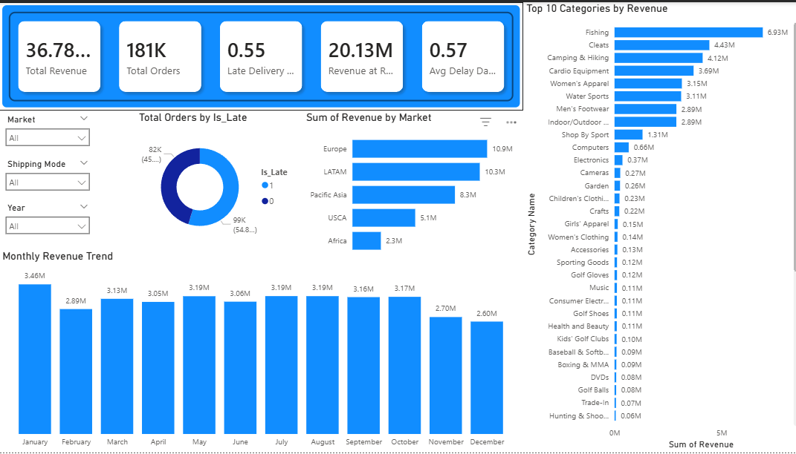

# 📊 Supply Chain Power BI Dashboard

> A 4-page interactive Power BI dashboard analysing 180,519 supply chain transactions — covering revenue performance, late delivery patterns, supplier risk, and demand forecasting.

> Companion project to the [Supply Chain Intelligence System](https://github.com/KirtanPatel18/supply-chain-intelligence) (Python ML + Streamlit app).

---

## 📸 Dashboard Preview

### Page 1 — Overview



### Page 2 — Late Delivery Analysis

](https://github.com/KirtanPatel18/supply-chain-powerbi-dashboard/blob/main/screenshots/late%20devilery%20analysis.png)

### Page 3 — Supplier Risk


### Page 4 — Demand Forecast


---

## 🗂️ Repository Structure

```
supply-chain-powerbi-dashboard/
│
├── dashboard/
│   └── supply_chain_dashboard.pbix     # Power BI file
│
├── screenshots/
│   ├── 01_overview.png
│   ├── 02_late_delivery.png
│   ├── 03_supplier_risk.png
│   └── 04_demand_forecast.png
│
└── README.md
```

---

## 📄 Dashboard Pages

### 1. Overview

- Total Revenue, Total Orders, Late Delivery Rate, Revenue at Risk KPI cards
- Monthly revenue trend
- Revenue by market
- On-time vs late order split

### 2. Late Delivery Analysis

- Late delivery rate by shipping mode
- Late delivery rate by order region
- Monthly late rate trend
- Market × shipping mode breakdown matrix

### 3. Supplier Risk

- Risk score by region (Low / Medium / High tiers)
- Late rate vs average delay scatter analysis
- Revenue split — safe vs at-risk by tier
- Full supplier risk scorecard table

### 4. Demand Forecast

- 6-month forward order forecast
- Historical vs forecasted demand comparison
- Forecast accuracy gauge
- Monthly forecast detail table

---

## 🛠️ Built With

- **Power BI Desktop**
- **DAX** measures for KPIs and dynamic calculations
- Data sourced from the [Supply Chain Intelligence System](https://github.com/KirtanPatel18/supply-chain-intelligence) Python pipeline (cleaned CSVs)

---

## 📥 How to Use

1. Download [Power BI Desktop](https://powerbi.microsoft.com/desktop) (free)
2. Clone this repo:
   ```bash
   git clone https://github.com/KirtanPatel18/supply-chain-powerbi-dashboard.git
   ```
3. Open `dashboard/supply_chain_dashboard.pbix` in Power BI Desktop
4. Explore using the slicers (Market, Year, Shipping Mode) on each page

---

## 🔗 Related Project

This dashboard uses data generated from the Python data science pipeline in:
👉 **[Supply Chain Intelligence System](https://github.com/KirtanPatel18/supply-chain-intelligence)**

That repo includes the full ML pipeline — late delivery prediction (ROC-AUC: 0.741), supplier risk segmentation, demand forecasting (92.8% accuracy), and a Streamlit web app.

---

## 👤 Author

**Kirtan Patel**

- GitHub: [@KirtanPatel18](https://github.com/KirtanPatel18)

---

## 📄 License

This project is open source and available under the [MIT License](LICENSE).
